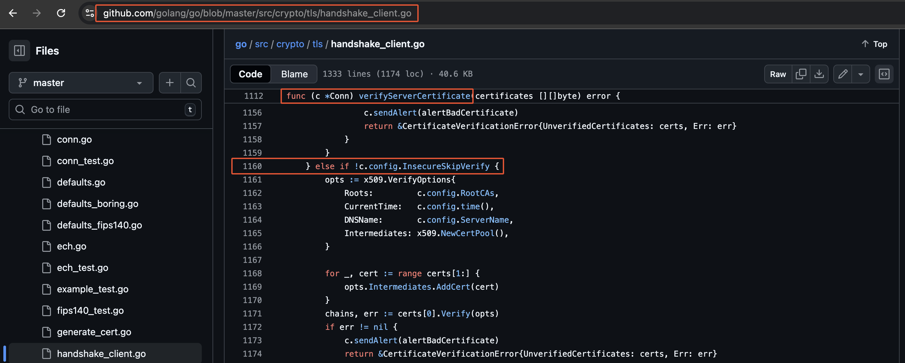
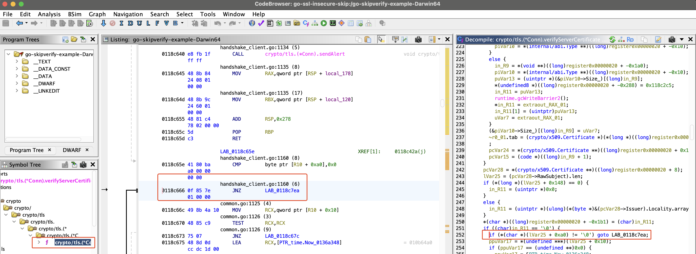

# go-skipverify

This tool is intended to patch Go binaries to bypass SSL verification and is based on CyberArk's blog post (https://www.cyberark.com/resources/threat-research-blog/how-to-bypass-golang-ssl-verification). I started with their python example and converted it to Go. I also added patches for newer versions of Go.

## Overview

To identify a patch perform the following steps:

1. Compile the binary with debug symbols using the version of Go and architecture you want to find a patch for

2. Look at the source code for the "verifyServerCertificate" function in the specific Go version (https://github.com/golang/go/blob/master/src/crypto/tls/handshake_client.go)



3. Load the compiled binary in Ghidra (or other decompiler)
4. Find the "verifyServerCertificate" function and identify the code to patch out




## Usage

You can test the patch by performing the following steps:

1. Compile the example code

```bash
GOOS=darwin GOARCH=amd64 CGO_ENABLED=0 go build -o go-skipverify-example-Darwin64 main.go
```

2. Test the binary by providing a proxy via environment variables. You can see it cannot verify the certificate.

```bash
HTTPS_PROXY=http://127.0.0.1:8080 ./example/go-skipverify-example-Darwin64
2025/10/05 13:13:31 Get "https://ipinfo.io/": tls: failed to verify certificate: x509: certificate signed by unknown authority
```

3. Patch the binary using the Go or python program.

```bash
./go-skipverify -in example/go-skipverify-example-Darwin64 -out example/go-skipverify-example-Darwin64-patched
Go version: go1.25.1
Major Go version: 1.25
File: example/go-skipverify-example-Darwin64
OS: macOS
Arch: AMD64
Patching for version: 1.25
Successfully patched and saved to: example/go-skipverify-example-Darwin64-patched
```

4. Run the patched binary and see it accept the certificate

```bash
HTTPS_PROXY=http://127.0.0.1:8080 ./example/go-skipverify-example-Darwin64-patched
2025/10/05 13:14:01 {
  "ip": "xx.xx.xx.xx",
  "city": "CITY",
  "region": "STATE",
  "country": "US",
  "loc": "xx.xxxx,-xx.xxxx",
  "org": "ISP COMPANY NAME",
  "postal": "12345",
  "timezone": "America/Chicago",
  "readme": "https://ipinfo.io/missingauth"
}
```

# References

- [CyberArk - How to Bypass Golang SSL Verification](https://www.cyberark.com/resources/threat-research-blog/how-to-bypass-golang-ssl-verification)
